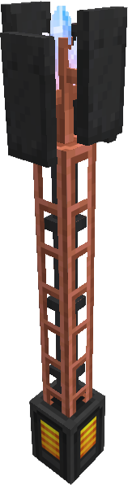

  

<h1>

Nodeworks

</h1>

---

Nodeworks is a mod that lets you create programmable logistics and automation networks.

## Documentation

Player-facing docs live in [`guidebook/`](guidebook/) as Markdown + YAML + embedded 3D scene
references. Once the GuideME integration is wired up (see below), the same source renders both
in-game and on the docs website.

- **[Contributor authoring guide](docs/authoring.md)**, how to add pages, build and import 3D scenes, and finish wiring the GuideME integration.
- **[guidebook/index.md](guidebook/index.md)**, current landing page.

## Backlog

Known limitations and deferred improvements, captured as TODOs so they don't get lost:

- [ ] **Preserve item data components in Processing Set storage.** The Processing Set's NBT format stores only `(itemId, count)` per slot. This means:
  - JEI `[+]` transfer skips any recipe ingredient/output that has non-default data components (potions, enchanted items, suspicious stew, dyed armor, etc.), those slots are left empty instead of showing as "Uncraftable Potion" placeholders. See [NodeworksJeiPlugin.kt `extractItemAndCount`](common/src/main/kotlin/damien/nodeworks/integration/jei/NodeworksJeiPlugin.kt).
  - The corresponding storage keys in [ProcessingSet.kt](common/src/main/kotlin/damien/nodeworks/card/ProcessingSet.kt) (`INPUTS_KEY`, `OUTPUTS_KEY`, etc.) would need to carry a serialized `DataComponentPatch` per slot.
  - Canonical-ID (handler key) derivation would also need to incorporate component data to keep handlers addressable by recipe identity.
- [ ] **Monitor fluid tracking.** Monitor blocks currently only display items. Extend [MonitorBlockEntity.kt](common/src/main/kotlin/damien/nodeworks/block/entity/MonitorBlockEntity.kt) to accept a fluid id (set via wrench/card-programmer on a fluid-kind handle) and surface network fluid totals via `NetworkStorageHelper.countFluid`. Renderer would pull the fluid still texture through `PlatformServices.fluidRenderer` and render it in place of the item icon, with the mB count below.
- [ ] **Fluid crafting.** Recipes that consume or produce fluids (smelting with lava buckets, Create mixers, Mekanism chemical recipes, etc.) aren't part of the crafting graph. Extend [CraftTreeBuilder.kt](common/src/main/kotlin/damien/nodeworks/script/CraftTreeBuilder.kt) + [CraftingHelper.kt](common/src/main/kotlin/damien/nodeworks/script/CraftTreeBuilder.kt) so a node can depend on N mB of a fluid id, add fluid-aware processing handlers (`job.pullFluid(...)`). Requires threading `$fluid:<id>` filters through the CPU buffer and the instruction-set UI.
- [ ] **GuideME live-reload watcher crashes on page save (Windows).** `guideme:26.1.10-alpha`'s `GuideSourceWatcher.pageDeleted` passes a resource-location-format string (`nodeworks:broadcasting-network.md`) to `java.nio.file.Path.resolve()`, which rejects the `:` on Windows. Fires on every file save because editors save-via-temp-then-rename is interpreted as a delete+add cycle. Live-preview still works (edits do show up), the watcher just spams the log. Fix is upstream in GuideME, file an issue at [github.com/AppliedEnergistics/guideme](https://github.com/AppliedEnergistics/guideme/issues) linking [`GuideSourceWatcher.java:273`](https://github.com/AppliedEnergistics/guideme/blob/main/src/main/java/guideme/internal/GuideSourceWatcher.java). No workaround on our side.
