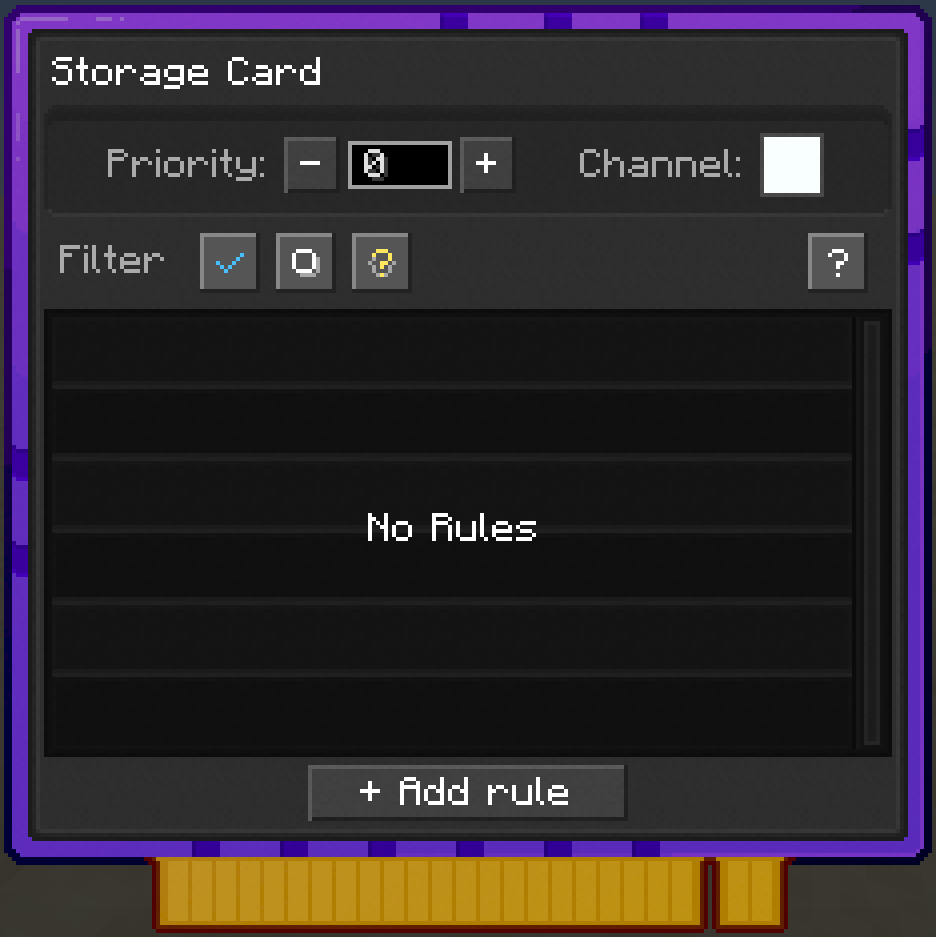

---
navigation:
  parent: items-blocks/index.md
  icon: storage_card
  title: Storage Card
categories:
  - card
description: marks the adjacent block as part of network storage
item_ids:
- nodeworks:storage_card
---

# Storage Card

A Storage Card marks the adjacent block as part of [Network Storage](../nodeworks-mechanics/network-storage.md). The
shared pool the network queries, routes into, and lists in the Inventory
Terminal.

<ItemImage scale="6" id="storage_card" />

## Configuring Priority

When you right-click with a **Storage Card** you can set the priority.
A higher value means that card will be used first when storing items into the Network.

> **Tip:** Use a <ItemLink id="card_programmer" /> to copy priority (and other settings)
across multiple cards at once. Useful when you've got a row of chests that
should all share the same priority or a shared name.

## Installation and scripting

Installed the same way an <ItemLink id="io_card" /> is. Slot into a face of
a node that's touching the block. The scripting API is identical to an IO
Card (see [CardHandle](../lua-api/card-handle.md#inventory-cards) for the full set of methods)

## The difference from IO

<ItemLink id="io_card" />'s blocks are script-controlled inventories.
Scripts must explicitly move items to/from them. A Storage Card puts its
block *into* the network's shared pool: `network:find` sees it, the
<ItemLink id="inventory_terminal" /> and <ItemLink id="portable_inventory_terminal" /> list it, and crafting recipes pull ingredients from it
automatically.

## Recipe

<RecipeFor id="storage_card" />