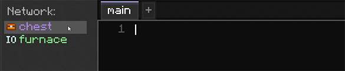
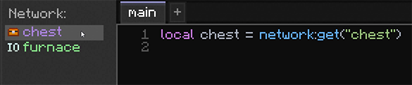
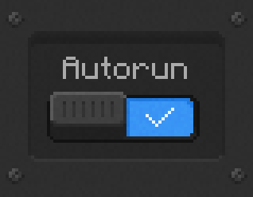

---
navigation:
  parent: lua-api/index.md
  title: Network
  icon: node
categories:
  - api_builtin
description: query storage, route items, open craft jobs, register handlers
---

# Network

The `network` module is the entry point into the live Nodeworks network the <ItemLink id="terminal" /> is
attached to. It queries storage, routes items between handles, and registers callbacks.

## get

Returns a reference to anything on the network addressed by name, any
<ItemLink id="storage_card" />, <ItemLink id="io_card" />, <ItemLink id="redstone_card" />,
<ItemLink id="observer_card" />, or <ItemLink id="variable" />, typically used at
the top of the script. Cards take priority on a name collision with a variable.

You can click on the sidebar of the scripting terminal to auto-get them as well.

 

<GameScene zoom="5" interactive={true} paddingLeft="50" paddingRight="60">
  <ImportStructure src="../assets/assemblies/chest_furnace_terminal.snbt" />
  <BoxAnnotation min="1 1.1 0.1" max="1.25 1.9 0.9" color="#AA83E0">
    Renamed to **"chest"**<ItemImage id="nodeworks:storage_card" />
  </BoxAnnotation>
  <BoxAnnotation min="1 0.1 0.1" max="1.25 0.9 0.9" color="#83E086">
    Renamed to **"furnace"**<ItemImage id="nodeworks:io_card" />
  </BoxAnnotation>
</GameScene>

<LuaCode>
```lua
local chest = network:get("chest")        -- gets the Storage Card
local furnace = network:get("furnace")    -- gets the IO Card
local count = network:get("count")        -- gets a Variable named "count"
```
</LuaCode>

---

## getAll

Returns a [HandleList](handle-list.md) of every card or variable matching the
given type. The HandleList broadcasts write methods (`:set`, `:onChange`, …)
across every member, so toggling many pistons or registering a handler on
many observers takes one line. To iterate per-member, call `:list()`.

<GameScene zoom="5" interactive={true} paddingLeft="50" paddingRight="60">
  <ImportStructure src="../assets/assemblies/chest_connected_storage_card.snbt" />
  <BoxAnnotation min="2.25 1.1 0.1" max="2 1.9 0.9" color="#AA83E0">
    <ItemImage id="nodeworks:storage_card" />
  </BoxAnnotation>
  <BoxAnnotation min="2.25 0.1 0.1" max="2 0.9 0.9" color="#AA83E0">
    <ItemImage id="nodeworks:storage_card" />
  </BoxAnnotation>
</GameScene>

<LuaCode>
```lua
-- Broadcast: turn every redstone card on at once
network:getAll("redstone"):set(true)
-- Iterate per-member when you need the value of a read method
local storages = network:getAll("storage")
for _, storage in storages:list() do
    print(storage.name)
end
-- "storage_0"
-- "storage_1"
```
</LuaCode>

---

## cards

Returns a [HandleList](handle-list.md) of the matching globbed card names. Useful
for when you want to interact with multiple cards at the same time with the same
naming convention.

<LuaCode>
```lua
local allPistonCards = network:cards("piston_*")
allPistonCards:set(true) -- turn on all pistons
```
</LuaCode>

---

## channel

Scopes lookups to a single dye-color channel. Returns a [`Channel`](./channel.md) handle whose
`:get`, `:getAll`, and `:getFirst` only see cards, variables, and devices set to
that color, the same channel filter applies. Errors on unknown color names.

<LuaCode>
```lua
local red = network:channel("red")
red:getAll("redstone"):set(true) -- only the red-channel pistons
local count = red:get("counter") -- variable on the red channel
```
</LuaCode>

---

## find

Scans all [Network Storage](../nodeworks-mechanics/network-storage.md) for
items/fluids matching the filter. Returns an aggregated handle *(count summed across storage)*
or `nil` if nothing matches.

<LuaCode>
```lua
local all = network:find("*") -- gets all items and fluids if any
local allItems = network:find("$item:*") -- only items
local allFluids = network:find("$fluid:*") -- only fluids
local allCoal = network:find("minecraft:coal") -- item id
local allLogs = network:find("#minecraft:logs") -- tags
local allRaw = network:find("/^Raw.*/") -- regular expressions
```
</LuaCode>

When using items from `:find` you should check to see if you have any first

<LuaCode>
```lua
local allCoal = network:find("minecraft:coal")
if allCoal then
  print("we have coal")
end
```
</LuaCode>

---

## findEach

Like [find](./network.md#find), scan all [Network Storage](../nodeworks-mechanics/network-storage.md)
for matching items/fluids matching the filter. But instead returns a list of [ItemsHandle](./items-handle.md)'s.
Each entry is unique by its Item ID and if it contains NBT Data.

<LuaCode>
```lua
for _, items in network:findEach("$item:*") do
  print(items.id, items.count, items.kind)
end
```
</LuaCode>

If you had diamond sword in your network, some with enchantments and some without
they would be separated into different entries

<LuaCode>
```lua
for _, items in network:findEach("minecraft:diamond_sword") do
  print(items.id, items.hasData)
end
-- "minecraft:diamond_sword" true
-- "minecraft:diamond_sword" false
```
</LuaCode>

---

## count

Returns the total quantity in [Network Storage](../nodeworks-mechanics/network-storage.md)
that matches the filter. (Fluids count in mB)

The filtering is the exact same syntax as [find](network.md#find)

<LuaCode>
```lua
print("swords:", network:count("minecraft:diamond_sword"))
print("cobblestone:", network:count("minecraft:cobblestone"))
print("all:", network:count("*"))
-- "swords:" 3
-- "cobblestone:" 256
-- "all:" 259
```
</LuaCode>

---

## insert

Inserts an [ItemsHandle](items-handle.md) into [Network Storage](../nodeworks-mechanics/network-storage.md) using the standard
<ItemLink id="storage_card" /> priority rules. Every single item has to fit otherwise
none are moved and the function returns `false`. If you want a best-effort insert then
use [tryInsert](./network.md#tryinsert)

<LuaCode>
```lua
local ok = network:insert(items)
if ok then
  print("all items were moved")
else
  print("no items were moved, not enough space")
end
```
</LuaCode>

---

## tryInsert

Like [`insert`](network.md#insert) but moves whatever fits instead of
all-or-nothing. Returns the count that actually landed (0 up to the requested amount).
Anything that didn't fit stays in the source. Use this when a partial move is fine.

<LuaCode>
```lua
local moved = network:tryInsert(items)
print(moved .. " items were moved") -- can be 0 to items.count
```
</LuaCode>

---

## craft

(also see [Auto-Crafting](../nodeworks-mechanics/autocrafting.md))

Queues a craft for the given item. Returns a [CraftBuilder](./craft-builder.md) or nil.

You can either `store` the crafted item into [Network Storage](../nodeworks-mechanics/network-storage.md)
as soon as it finishes

<LuaCode>
```lua
local builder = network:craft("minecraft:door")
builder:store() -- put crafted item into network storage
```
</LuaCode>

Or you can connect a handler to put it somewhere custom

<LuaCode>
```lua
local furnace = network:get("someFurnaceCard")
local builder = network:craft("minecraft:charcoal")
builder:connect(function(item: ItemsHandle)
  furnace:insert(item)
end)
```
</LuaCode>

---

## shapeless

Instantly crafts a shapeless recipe with ingredients from [Network Storage](../nodeworks-mechanics/network-storage.md).
If the recipe is invalid or ingredients are missing then nothing is crafted and
the function returns `nil`.

<LuaCode>
```lua
-- craft a flint and steel, output automatically goes into network storage.
network:shapeless("minecraft:flint", 1, "minecraft:iron_ingot", 1)
```
</LuaCode>

---

## handle

(also see [Auto-Crafting](../nodeworks-mechanics/autocrafting.md))

Registers a processing handler for an in-network <ItemLink id="processing_set" />.
The handler is invoked with inputs and must use the passed [Job](job.md) to `pull`
outputs. All items given from the [InputItems](input-items.md) **must** be taken
by the handler.

<GameScene zoom="5" interactive={true} paddingTop="40" paddingLeft="60" paddingRight="30">
  <ImportStructure src="../assets/assemblies/processing_storage_single_entry.snbt" />
  <BoxAnnotation min="1.9 0.1 0.75" max="1.1 0.9 1" color="#83E086">
    Renamed to **"furnace"**<ItemImage id="nodeworks:io_card" />
  </BoxAnnotation>
  <BlockAnnotation x="0" y="0" z="0">
    <Row>
      <ItemImage id="minecraft:raw_iron" />
      **➜**
      <ItemImage id="minecraft:iron_ingot" />
    </Row>
  </BlockAnnotation>
</GameScene>

<LuaCode>
```lua
local furnace = network:get("furnace")
-- handler for raw iron -> iron ingot
network:handle("…", function(job: Job, items: InputItems)
  furnace:face("top"):insert(items.rawIron)
  job:pull(furnace:face("bottom"))
end)
```
</LuaCode>

---

## route

Sets a filter to a target <ItemLink id="storage_card" /> using a predicate function.
This function should return `true` if the [ItemsHandle](items-handle.md) should be accepted by the storage.

<LuaCode>
```lua
network:route("cobblestone_only", function(item: ItemsHandle)
  return item.id == "minecraft:cobblestone" -- true if item id is "minecraft:cobblestone"
end)
```
</LuaCode>

If you have multiple storage cards with _N suffixes ( `non_stackable_0`, `non_stackable_1`, `non_stackable_2` etc. )
then you can refer to all of them using a wildcard ( \* )

<LuaCode>
```lua
-- matches all non_stackable_ Storage Cards
network:route("non_stackable_*", function(item: ItemsHandle)
  return not item.stackable
end)
```
</LuaCode>

> **Tip:** It's also recommended to turn on the ["Autorun"](../items-blocks/scripting_terminal.md#autorun) of the <ItemLink id="terminal" />
> if it's using `route`



---

## debug

Prints a summary of the network topology

<LuaCode>
```lua
network:debug()
-- === Network Debug ===
-- Controller: BlockPos{x=-25, y=70, z=10}
-- Nodes: 1
--   Node BlockPos{x=-25, y=70, z=9}: 1 cards
--     NORTH: cobblestone_storage (storage)
-- Terminals: 1
--   BlockPos{x=-26, y=70, z=9}
-- CPUs: 0
-- Crafters (Instruction Sets): 0
-- Processing APIs: 0
-- Variables: 0
```
</LuaCode>